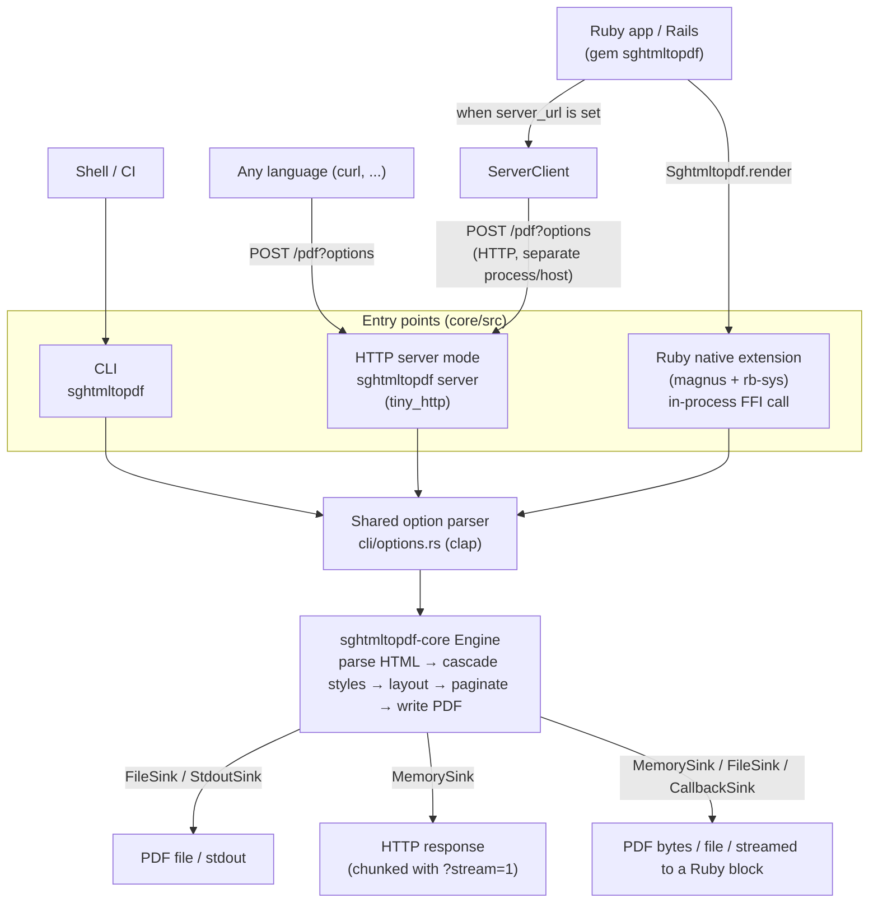

# sghtmltopdf

An HTML-to-PDF renderer like wkhtmltopdf written in Rust that does not depend on Chromium, WebKit, or Gecko.

[Documentation](https://waka.github.io/sghtmltopdf/) ([English](https://waka.github.io/sghtmltopdf/en/))

## What is this

sghtmltopdf turns HTML into PDF without starting a browser process.
It is aimed at documents that flow top to bottom with explicit breaks invoices, receipts, reports rather than at rendering arbitrary web pages.


That receipt is [`examples/receipt.html`](examples/receipt.html) plus [`examples/main.css`](examples/main.css), rendered with one command and no browser:

```sh
sghtmltopdf examples/receipt.html -o receipt.pdf
```

The result is committed as [`examples/receipt.pdf`](examples/receipt.pdf).
The stylesheet is ordinary CSS Flexbox, tables, custom properties, `counter-increment` for the row numbers, `border-radius`, and CJK text shaped from a system font.
The `1 / 1` and the document number along the bottom edge are margin boxes: `@page { @bottom-center { content: counter(page) " / " counter(pages) } }`.

Compared with the common headless-Chrome approach:

* No browser process. One binary, or a native extension living inside your Ruby process.
* Fonts are resolved during rendering. There is no `document.fonts.ready` to wait for, so a PDF is never emitted with unresolved webfonts.
* Streaming. HTML is read in chunks and each page is written out as soon as its layout is final, so memory does not grow with document size (measured: 228MB → 28MB on a 60,000-element document).
* Page breaks are first class. CSS Fragmentation (`break-before`, `break-inside`, `orphans`, `widows`) and `@page` are implemented directly.

### What is actually rendering this

The layout engine is written for this project. HTML parsing is [html5ever](https://github.com/servo/html5ever), CSS parsing is [cssparser](https://github.com/servo/rust-cssparser), and selector matching is the [selectors](https://github.com/servo/stylo) crate all from Servo, and all of them battle-tested (Firefox ships the same selector engine through Stylo). Those give a DOM and computed styles. Everything after that box generation, line breaking, table layout, pagination, PDF writing—is code in this repository.

That is the whole reason for the trade-off in both directions. CSS coverage is a subset rather than everything a browser supports, because every property is implemented here rather than inherited. And in return, pagination is what the engine is built around instead of something bolted onto a screen-oriented layout: repeating table headers across page breaks, `@page` margin boxes, and streaming a page out the moment its layout is final are all things a browser cannot be asked to do.

Text shaping and font handling go through the usual Rust stack. No browser engine is embedded, and this is not a fork of anything.

Future-goals: executing JavaScript, pixel-perfect parity with browsers, and full CSS coverage. See [what is not supported](https://waka.github.io/sghtmltopdf/appendix/limitations.html).

### Where the name comes from

I was able to ship PDF output at all because [wkhtmltopdf](https://wkhtmltopdf.org/), and [wicked_pdf](https://github.com/mileszs/wicked_pdf) that made it usable from Rails, were out there as open source.
The HTML templates I already knew how to write came back to me as a PDF, and that genuinely amazed me. Those two libraries had my deep respect.

wkhtmltopdf was archived in 2023.

I want the next programmer who is handed "make this print to PDF" to feel what I felt back then. This project is an attempt to carry that on, which is why the name starts with `sg` — *Second Generation*.

## Usage

Three entry points share the same engine and the same options.

```sh
# CLI
sghtmltopdf invoice.html -o invoice.pdf --page-size A4 --margin-top 20mm

# HTTP server
sghtmltopdf server --listen 127.0.0.1:8080
curl --data-binary @invoice.html 'http://127.0.0.1:8080/pdf?page-size=A4' -o invoice.pdf

# HTTP server, from the official image (Japanese fonts included, no arguments needed)
docker run --rm -p 8080:8080 ghcr.io/waka/sghtmltopdf
```

```ruby
# Ruby (gem "sghtmltopdf")
pdf = Sghtmltopdf.render("<h1>Invoice</h1>", page_size: "A4")
```

Local references (``, external CSS, `@font-face`) stay inside the base directory (`--base-url`, defaulting to the input HTML's own directory); a `../` that would escape it is an error, so untrusted HTML cannot read arbitrary files.
Pass `--allow <DIR>` to widen the boundary, or `--disable-local-file-access` to close it entirely (the HTTP server does the latter by default, and never lets a request loosen it).

The CLI flags are the ones you already know: most of them keep the same name and meaning as [wkhtmltopdf](https://wkhtmltopdf.org/usage/wkhtmltopdf.txt) (`--page-size`, `--margin-top`, `--orientation`, `--header-html`, `--toc`, …).
Flags that will not be implemented exit 1 with the reason and an alternative instead of being silently ignored — see the [option table](https://waka.github.io/sghtmltopdf/migration/wkhtmltopdf-options.html) for the full list, and [migrating from wkhtmltopdf](https://waka.github.io/sghtmltopdf/migration/wkhtmltopdf.html) for the cases where the same name behaves differently (CSS `@page` wins over the CLI, the default margin is 1in, cover and TOC are options rather than positional arguments).

Option names are the CLI long options without `--` and with `-` replaced by `_`, so `--page-size A4` becomes `page_size: "A4"`.
The engine runs inside the same process through a native extension (magnus + rb-sys) no subprocess, no temporary files and releases the GVL while rendering, so other Puma threads keep running.

### Rails

Add the gem and the Railtie wires everything up.
Nothing is loaded when Rails is absent, so plain Ruby and Sinatra are unaffected.

```ruby
# Gemfile
gem "sghtmltopdf"
```

```ruby
# config/initializers/sghtmltopdf.rb
Sghtmltopdf.configure do |c|
  c.page_size   = "A4"
  c.gothic_font = Rails.root.join("vendor/fonts/NotoSansJP-Regular.ttf")
end
```

A `:pdf` renderer is registered, in the spirit of [wicked_pdf](https://github.com/mileszs/wicked_pdf) — the same keys, so an existing controller often needs no change at all:

```ruby
class InvoicesController < ApplicationController
  def show
    render pdf: "invoice",              # filename; ".pdf" is appended
      template: "invoices/show",
      layout: "pdf",
      page_size: "A4", margin_top: "20mm"
  end
end
```

View-rendering keys (`template`, `layout`, `locals`, …) go to `render_to_string`, response keys (`filename`, `disposition`, `status`) go to `send_data`, `show_as_html: true` returns the HTML instead of a PDF, and everything else is passed to the converter.
The converter keys are flat CLI flag names, so wicked_pdf's nested `margin: {top: 10}` becomes `margin_top: "10mm"` (with the unit spelled out); [migrating from wicked_pdf](https://waka.github.io/sghtmltopdf/migration/wicked-pdf.html) maps every key one by one.

PDF rendering does not go through the HTTP server, so `/assets/…` URLs are resolved as local files: the Railtie defaults `base_url` to `Rails.root/public` and restricts local reads to `Rails.root` via `allow`.
That is enough for a precompiled production app; in development, these helpers put the asset into the document itself — the CSS in a `<style>`, the image as a `data:` URI — so nothing has to be fetched and the file may live outside `public/`:

```erb
<%= sghtmltopdf_stylesheet_link_tag "pdf" %>
<%= sghtmltopdf_image_tag "logo.png" %>
```

To send pages as soon as their layout is final, pass a block and use `ActionController::Live` this also makes `Rack::Timeout` and `Thread#kill` effective at chunk boundaries:

```ruby
class InvoicesController < ApplicationController
  include ActionController::Live

  def show
    response.headers["Content-Type"] = "application/pdf"
    html = render_to_string(template: "invoices/show", layout: "pdf")
    Sghtmltopdf.render(html) { |bytes| response.stream.write(bytes) }
  ensure
    response.stream.close
  end
end
```

If the gem cannot run where your app runs (Windows, Intel Mac) or you would rather not spend the app's CPU on rendering, set `server_url` and the same calls are delegated to a separate `sghtmltopdf server` process.

```ruby
Sghtmltopdf.configure { |c| c.server_url = "http://{REMOTE_SERVER_URL}:8080" }
```

Everything else the full option reference, the HTTP API, CSS support tables, and migration guides from wkhtmltopdf and wicked_pdf lives in the [documentation site](https://waka.github.io/sghtmltopdf/) ([Ruby / Rails](https://waka.github.io/sghtmltopdf/usage/ruby_rails.html)).

The Docker image (`linux/amd64` and `linux/arm64`) bundles BIZ UDPGothic and BIZ UDPMincho, so Japanese documents render without supplying a font, and the same HTML always produces the same PDF regardless of the host's fonts.
`ENTRYPOINT` is the binary itself: no arguments starts the server, arguments run the CLI.

```sh
docker run --rm -v "$PWD:/work" -w /work --user "$(id -u):$(id -g)" \
    ghcr.io/waka/sghtmltopdf invoice.html -o invoice.pdf
```

To keep the server around next to your app, Compose is the shortest route the image needs no command, and inside the container it listens on `0.0.0.0:8080`.

```yaml
services:
  pdf:
    image: ghcr.io/waka/sghtmltopdf:0.1
    ports: ["8080:8080"]
    healthcheck:
      test: ["CMD", "sghtmltopdf", "--version"]
      interval: 30s
```

`curl` is not in the image, so the health check uses `--version`; hit `GET /healthz` from the outside (a load balancer, say) if you want the server itself checked.
Point the Ruby side at it with `Sghtmltopdf.configure { |c| c.server_url = "http://pdf:8080" }`, and add `--font` and a mounted volume to the service's `command` if you need fonts other than the bundled ones.

## Architecture

CLI, HTTP server mode, and the Ruby binding (native extension, or delegating to an HTTP server) are four different doors into the same option parser (`cli/options.rs`) and the same engine (`sghtmltopdf-core`). What differs is how the call comes in, and where the resulting PDF bytes are written (the `Sink`).



The native extension does not spawn a subprocess it runs inside the same process as your app (Puma worker, etc.) as FFI, releasing the GVL while rendering so other threads keep going. Delegation to an HTTP server only happens when `server_url` is configured, and that server can be a sibling process on the same host or a remote one.

## Guide for developer

### Layout

```
core/           # Rust engine + CLI + HTTP server (no Ruby dependency)
bindings/ruby/  # Ruby binding (magnus + rb-sys) and the Rails integration
docs/           # Documentation site (mdbook, ja + en)
```

`bindings/ruby` is excluded from the root Cargo workspace, so a plain `cargo build` works without a Ruby toolchain.

### Rust

```sh
cargo build --release                                   # binary at target/release/sghtmltopdf
cargo test --workspace
cargo fmt --all --check
cargo clippy --workspace --all-targets -- -D warnings
```

Feature flags: `cli` (argument parsing) and `server` (HTTP server) are on by default. Build the library alone with `--no-default-features`.

### Ruby gem

Requires a Rust toolchain and libclang (for `rb-sys`).

```sh
cd bindings/ruby
bundle install
bundle exec rake            # compile, then run specs
bundle exec rake compile
```

Some specs compare gem output with the CLI byte for byte, and are skipped unless `target/release/sghtmltopdf` exists run `cargo build --release` first.

### Documentation site

```sh
cargo install mdbook mdbook-mermaid mdbook-i18n-helpers

cd docs
mdbook serve                                        # Japanese (the source language)
MDBOOK_BOOK__LANGUAGE=en mdbook serve -d book/en    # English
```

Markdown under `docs/src` is written in Japanese; the English version is a gettext catalog at `docs/po/en.po`.
After editing the Japanese text, refresh the catalog (requires the `gettext` package):

```sh
MDBOOK_OUTPUT='{"xgettext": {}}' mdbook build -d po
msgmerge --update po/en.po po/messages.pot
```

Entries whose source changed are marked `fuzzy` review and update those, then remove the marker.
Pushing to `main` builds both languages and deploys to GitHub Pages.

## License

MIT License ([LICENSE](LICENSE)).
