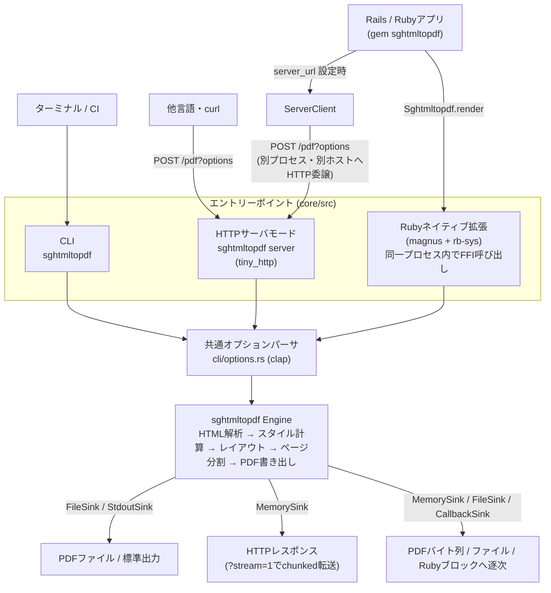

# sghtmltopdf とは

HTML をそのまま PDF として出力するための変換器/レンダラーです。
Rust で書かれており、Chromium/WebKit/Geckoのヘッドレスブラウザのインストールを必要とせず PDF を出力できます。

使い方は、CLI・HTTPサーバ・ライブラリの3種類から選択でき、どれも同じエンジンを同じオプションで動かします。
ライブラリについては、現時点で Rubygems に対応しています。

PDFエンジンは、html5ever/Stylo/Taffy といった Servo が提供している Rust クレートをベースに構築しています。

## wkhtmltopdf/WickedPDF への感謝

作者が初めてWebアプリ上で PDF を出力する機能を実装することになったとき、当時の開発環境は Ruby on Rails だったのですが、[wkhtmltopdf](https://github.com/wkhtmltopdf/wkhtmltopdf) と Railsから使うための [wicked_pdf gem](https://github.com/mileszs/wicked_pdf) を使っていました。  
それまで何となく PDF は難しそうで敬遠していたのですが、HTML で見た目を確認してそのまま PDF に出力できるという快適な開発フローに感動したのを覚えています。

しかし、[wkhtmltopdf](https://github.com/wkhtmltopdf/wkhtmltopdf) は依存していた QtWebKit がメンテナンス終了になったため、それに伴い2023年1月にアーカイブされてしまいました。  
現在は、Headless Chrome等のヘッドレスブラウザを使って PDF を出力する場面が多いと思います。

個人的にwkhtmltopdf のアプローチがとても好きだったので、使っていて感じた課題を解消させてモダナイズした wkhtmltopdf を作ろうと思いました。  
sghtmltopdf の「sg」は Second Generation の略で、wkhtmltopdf にお世話になった敬意を込めて「第2世代」とつけました。

## wkhtmltopdf（QtWebKit）やヘッドレスブラウザを使ったPDF出力に感じていた課題

wkhtmltopdf に特有のもの:

- QtWebKit が古く、CSS3 への対応が限定的（Flexbox・Grid・カスタムプロパティに非対応）
- Webfont を使うと、読み込みを待たずに PDF 出力されてしまうことがある
- 表（Table）の最中で改ページした場合、改ページ後のページに表のヘッダーが出せない

ヘッドレスブラウザにも共通するもの:

- Webアプリとは別にバイナリをインストールする必要があり、AWS Lambda などで環境構築に手間がかかる
- 巨大な HTML が渡ってくると、出力にかかる時間やメモリ消費コストが一気に増える

これらを解決するために、sghtmltopdf では以下のような対応を入れました。

- Flexbox・Grid・カスタムプロパティを含む CSS3 に対応（`!important` やグラデーションなど、対応していないものは[プロパティ対応表](supports/properties.md)を参照）
- Webfont（`@font-face`）を、非同期の読み込み待ちなしに決定論的なタイミングで解決。汎用ファミリー名の実体は`--serif-font`/`--gothic-font`/`--mono-font`で個別に指定可能
- 表（Table）の途中で改ページが起きても、`<thead>`の行を次のページ以降の先頭に繰り返す
- 追加のランタイムなしに動く実行ファイル1つ、または[公式Dockerイメージ](getting-started/docker.md)で配布。Ruby からはネイティブ拡張として呼べるので、ブラウザプロセスを起動せずWebアプリのプロセスに同居できる
- ブラウザエンジンを載せ替えるのではなく、PDF出力に特化したレンダリングエンジンを実装。画面描画やスクリプト実行のための仕組みを持たないぶん、文書が大きいほど処理時間の差が開く（60,000要素の文書で wkhtmltopdf の約21倍、ヘッドレスChromeの約53倍。[パフォーマンス比較](#wkhtmltopdf--ヘッドレスchromeとのパフォーマンス比較)）
- HTML をチャンク単位で読み、確定したページから書き出す[ストリーミングモード](usage/cli/streaming.md)を用意。段落が主体の文書ではメモリ消費量を大きく抑えられる（書き出しの区切りが`<body>`直下の要素単位のため、巨大な表が1つだけの文書では効果がない）

### wkhtmltopdf / ヘッドレスChromeとのパフォーマンス比較

同じHTMLを同じ用紙設定で変換したときの実測値です。
用紙設定は「用紙A4・余白10mm」を`@page`で指定し、フォントは`@font-face`で同じファイルを参照しています。

比較対象は、アーカイブ時点の最終版である wkhtmltopdf 0.12.6.1 と、Google Chrome 151 のヘッドレスモードです。
各セルは「ピークメモリ / 処理時間」を表します。

この比較は `cargo run --release --example compare_engines` で出したものです。

段落が主体の文書:

| 要素数 | sghtmltopdf | sghtmltopdf（ストリーミング） | wkhtmltopdf | ヘッドレスChrome |
|---|---|---|---|---|
| 5,000 | 26MB / 0.11秒 | 9MB / 0.10秒 | 44MB / 0.49秒 | 543MB / 1.32秒 |
| 20,000 | 80MB / 0.46秒 | 14MB / 0.34秒 | 86MB / 2.60秒 | 943MB / 7.45秒 |
| 60,000 | 230MB / 1.99秒 | 25MB / 1.31秒 | 199MB / 42.02秒 | 1,525MB / 105.77秒 |

表が主体の帳票:

| 行数 | sghtmltopdf | sghtmltopdf（ストリーミング） | wkhtmltopdf | ヘッドレスChrome |
|---|---|---|---|---|
| 5,000 | 49MB / 0.56秒 | 48MB / 0.60秒 | 62MB / 1.55秒 | 1,372MB / 5.12秒 |
| 20,000 | 173MB / 2.44秒 | 173MB / 2.36秒 | 163MB / 14.60秒 | 6,222MB / 39.94秒 |

処理時間は文書が大きくなるほど差が開きます。
60,000要素では wkhtmltopdf の約21倍、ヘッドレスChromeの約53倍の速さです。
20,000行の帳票では、それぞれ約6.0倍・約16倍になります。

メモリは、wkhtmltopdfとはほぼ同等です。
60,000要素と20,000行の帳票では sghtmltopdf のほうがやや多く、文書サイズに比例して増える点も変わりません。
[ストリーミングモード](usage/cli/streaming.md)を使うと、段落主体の文書では25MBまで下がります。
一方、巨大な表が1つだけの帳票ではストリーミングの効果がありません。
確定したページを書き出す区切りが`<body>`直下の要素単位のため、表が1つしかない文書では表の最後を書き出すまでメモリを解放できないからです。

ヘッドレスChromeとは桁が違い、20,000行の帳票では6.2GBに達します。
ヘッドレスChromeはブラウザとして必要な機能が全て含まれているため、PDF出力に特化した sghtmltopdf の方がメモリ効率が良くなります。

## 全体の構成

CLI・HTTPサーバモード・Ruby（ネイティブ拡張 / HTTPサーバへの委譲）の4つの経路は、すべて同じオプション定義（`cli/options.rs`）と同じエンジン（`sghtmltopdf`）を通ります。
違うのは呼び出し方と、変換後のPDFバイト列をどこへ書き出すか（Sink）だけです。

Rubyのネイティブ拡張はサブプロセスを起動せず、WebアプリのプロセスにFFIとして同居します（変換中はGVLを解放するため他のスレッドは止まりません）。
`server_url`を設定した場合だけ、変換は別プロセスの `sghtmltopdf server` へHTTPで委譲されます（同じホストの別プロセスでも、ネットワーク越しの別ホストでも構いません）。
Engine内部（HTML解析からPDF書き出しまで）をページ単位で流す仕組みは[ストリーミングモード](usage/cli/streaming.md)を参照してください。
